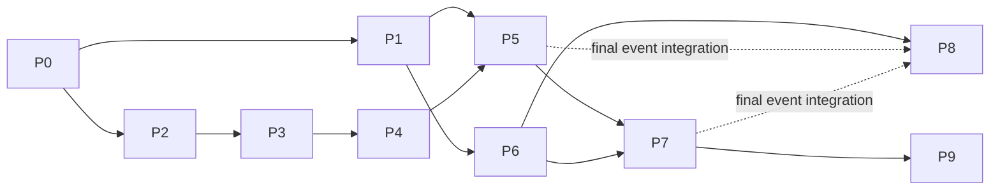

# 유아용품 에이전트 구현 작업 목록

각 문서는 해당 항목의 실제 구현을 수행할 에이전트에게 전달하는 독립 작업 지시서다. **2026-09-13 최신 변경과 stash를 반영했다. P0는 partial, P1은 조건 대화 부분 구현, P5는 PC 경로만 구현된 상태다.** `개발 역할 분담`의 인력·소유권 제한은 적용하지 않는다.

## COMMIT BASELINE — `d96ccd2`

`30af559..d96ccd2`의 영향만 추가 반영했다. P0는 새 목록 SQL·리뷰 메타데이터 마이그레이션 호환, P1은 카테고리 전환·대화 재시작 화면, P4/P5는 PC 리뷰 순위·설명 보존, P7은 추가된 목록 API의 축소 DB 통합, P8은 구현된 PC 리뷰 조회 재사용, P9는 해당 회귀 검증이 변경 대상이다. P2/P3/P6 지시서는 변경하지 않는다. P7/P8은 부분 구현이며 완료 승인이 아니다. 현재 `src/routers/lists.py` 충돌 때문에 전체 API 동작 검증은 막혀 있다.

## ACTIVE P0 DIRECTION

사용자 결정으로 **구 데이터 이관 없이 새 DB를 구축**한다. [P0 지시서](P0_schema_contracts.md)의 교체된 SR01–SR09가 현재 승인 기준이다. 기존 보고서·검토서의 데이터 보존/매핑 요구는 과거 기준이며 더 이상 선행 조건이 아니다. 실제 코드 전환·새 데이터 무결성·초기 설치/API 검증은 여전히 필요하다. P0는 아직 partial이며 이번 수정은 DB 삭제나 구현 완료를 의미하지 않는다.

## CURRENT REVIEW

[최신 통합 결과·P0 재작업 판단](reports/sync-2026-09-13.md)을 먼저 읽는다. P0를 처음부터 재작성하지 말고0010 준비 단계에서 최신 시드·PC 실행자까지 완전 전환한다. 다음 작업의 선행 조건을 P0 완료로 오인하지 않는다. 공통 계약은v2이며 추천은 최신202+BackgroundTasks 흐름을 유지한다.

## ENTRYPOINT

1. [공통 계약](CONTRACTS.md)을 읽는다. 함수·DTO·테스트 경로 중 새로 제안한 것은 구현할 산출물이며 현재 존재한다고 가정하지 않는다.
2. 아래 작업 문서 하나를 선택한다. 선행 작업의 실제 코드와 검증 결과를 확인한다.
3. 작업 문서의 READ FIRST → EDIT SURFACE → IMPLEMENTATION → ACCEPTANCE → VERIFY → EXIT 순서로 수행한다.
4. 결과는 지정된 `reports/Pn.md`에 기록한다. P0의 이전 partial 보고서와 이번 동기화 감사는 이미 있다. 나머지는 실제 구현 후 생성한다.

기계 판독: [manifest.json](manifest.json). 각 문서 상단 YAML에 task_id, depends_on, entry_gate, report_path를 기재했다.

## TASKS

| ID | 작업 문서 | 구현 선행 조건 | 완료 시 제공물 |
|---|---|---|---|
| P0 | [축소 DB·공통 계약·기존 코드 호환](P0_schema_contracts.md) | 없음 | 축소 SQL·기존 RAG 호환·공통 모델·schema-v1.md |
| P1 | [DB 접속·게스트 세션·조건 수집](P1_sessions_conditions.md) | P0 | DB 연결·쿠키·조건 저장/조회 API |
| P2 | [유아 카탈로그·단위·필요 품목 규칙](P2_catalog_requirements.md) | P0 | 멱등 상품 적재·필요 품목 규칙·후보 DTO |
| P3 | [후보 안전 조건·설명서 검증·근거 연결](P3_verification_rag.md) | P0, P2 | 후보별 판정·근거 JSON·권한 재검사 |
| P4 | [필수품·예산·구매 시점 최적화](P4_basket_optimizer.md) | P0, P2, P3 | 필수품·예산·구매 시점 최적화 결과 |
| P5 | [추천 실행·저장·결과·후보 편집 API](P5_recommendation_http.md) | P1, P2, P3, P4 | 추천/조회/편집 API·실제 브라우저 흐름 |
| P6 | [가입·비밀번호 인증·설정·게스트 인계](P6_authentication.md) | P1 | 가입/로그인/계정·게스트 인계 |
| P7 | [목록·확정 스냅샷·리포트·판매처 이동](P7_lists_reports.md) | P5, P6 | 목록/확정/리포트·스냅샷 보존 |
| P8 | [유아 후기·파일 기반 정제·요약/통계·행동 기록](P8_reviews_feedback.md) | P0, P6; 최종 이벤트 통합 검증은 P5·P7 | 후기/파일 정제/요약·통계/피드백 검증 |
| P9 | [운영 검증·자료 처리 확장·RAG 전환 게이트](P9_operational_validation.md) | P0, P3, P5, P7 | 현재 경로 준비도 검사·조건부 운영 검증 |

## DEPENDENCY GRAPH



P0의 남은 축소 스키마·시드·기존 RAG/PC 호환까지 완료한 뒤 P1/P2를 시작한다. P3는 후보 검증 업무를 추가한다. P4는 P8이 없어도 리뷰 없음 상태로 계산할 수 있어 순환 의존을 만들지 않는다. P5/P7은 이벤트를 직접 발생시키고 P8이 그 통합을 검증한다. P9는 현재 pgvector 유지 경로를 검증한다. 별도 벡터DB 전환은 현재 미선택이며 신규 명시적 변경 결정이 필요하다.

## DISPATCH PROMPT

```text
<작업 문서 절대경로>를 읽고 구현을 수행하라.
문서가 참조하는 CONTRACTS.md와 선행 작업의 실제 코드/보고서를 확인하라.
개발 역할 분담 문서는 적용하지 않는다.
명시된 범위의 코드, 데이터, 테스트, 실행 절차를 완성하고 실제 결과로 완료 조건을 증명하라.
기존 변경을 보존하고, 고정 성공 응답이나 데이터베이스 목으로 통합 완료를 대신하지 마라.
보고서는 문서의 report_path에 작성하라. 미충족 외부 조건은 실제 구현·검증 결과와 구분하라.
```

## ORIGIN

- [서비스 흐름·구현현황](../../유아용품_서비스흐름_구현현황_2026-09-12.md) §6 P0–P9
- [DB 축소안](../../../db_schema_reduction.md): 과거 축소 가정; 현재 pgvector 유지 결정은 최신 통합 보고서 참조
- [프론트 계약](../../frontend_외부수정요청.md): 인증·조건·결과 화면 입력/출력

기존 65건 테스트 통과·설명서 질의 21/21은 변경 전 구조의 기록이다. 각 작업은 새 코드·축소 구조에서 다시 검증해야 한다.
